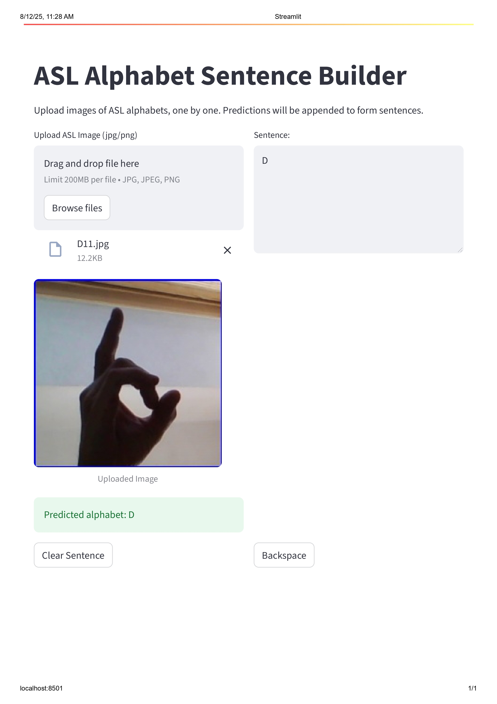

# 🤟 American Sign Language Alphabet Detection

## Project Overview

**American Sign Language Alphabet Detection** is an end-to-end deep learning application for interpreting ASL hand signs into text. Leveraging transfer learning with MobileNetV2, this project translates individual ASL alphabets through a user-friendly web interface, enabling sentence building from uploaded images. Ideal for educational tools, accessibility aids, or ML demonstrations, it combines high accuracy with practical deployment.

## 🚀 Features

- **High-Accuracy Recognition:** Over 94% test accuracy on 29 ASL classes using fine-tuned MobileNetV2.
- **Interactive UI:** Upload hand sign images to predict alphabets and build sentences dynamically.
- **Smart Controls:** Special signs for spacing (`space`) and deletion (`del`) integrated into predictions.
- **Extensible Pipeline:** Modular code for easy addition of live webcam support or further model enhancements.

## 🌟 Demo



## 🧠 Architecture

- **Core Model:** MobileNetV2 (pretrained on ImageNet, fine-tuned for ASL).
- **Input Handling:** 128x128 RGB images processed via TensorFlow/Keras.
- **Output:** 29-class softmax predictions mapped to ASL alphabets.
- **UI Framework:** Streamlit for seamless web-based interaction.

```

Image Upload → Preprocessing (Resize/Normalize) → MobileNetV2 Prediction → Sentence Assembly (with del/space logic)

```

## ⚙️ How it Works

1. Upload an image of an ASL hand sign via the UI.
2. The image is resized to 128x128 RGB and normalized.
3. MobileNetV2 predicts the class (e.g., 'A', 'space', 'del').
4. Prediction appends to the sentence: letters add directly, 'space' inserts whitespace, 'del' removes the last character.
5. Repeat uploads to form words/sentences, with manual clear/backspace options.

## 🛠️ Quickstart

**Prerequisites:** Python 3.8+, TensorFlow, Keras, Streamlit.

1. Clone the repository:
```

git clone https://github.com/your-username/asl-sign-detection.git
cd asl-sign-detection

```

2. Install dependencies:
```

pip install -r requirements.txt

```

3. Run the UI:
```

cd ui
streamlit run app.py

```

- Place your trained model in `checkpoints/best_mobilenet.h5` before running.

## 🎮 Usage

- **Launch the App:** Run the Streamlit command above; access at `http://localhost:8501`.
- **Upload Images:** Select JPG/PNG files of ASL signs.
- **Build Sentences:** Predictions append automatically; use 'del'/'space' signs for editing.
- **Training/Evaluation:** Use `main.py` with `--model mobilenet` for retraining or `--eval_only` for metrics.

## 🗂 Directory Structure

```

.
├── main.py                 \# Training/evaluation script
├── requirements.txt        \# Dependencies
├── README.md               \# This file
├── .gitignore              \# Git ignore rules
├── checkpoints/            \# Model weights (not tracked)
│   └── best_mobilenet.h5
├── models/                 \# Model definitions
│   └── transfer_mobilenet.py
├── utils/                  \# Helpers for data and evaluation
│   ├── data_prep.py
│   └── evaluation.py
├── results/                \# Output plots/confusion matrices
├── dataset/                \# Local data (not tracked)
│   ├── train/
│   └── test/
└── ui/                     \# Streamlit app
└── app.py

```

## 🏗️ Model Details

- **Backbone:** MobileNetV2 with custom head (GlobalAvgPool, Dropout, Dense layers).
- **Classes:** A-Z + 'del', 'nothing', 'space'.
- **Performance:** ~94% accuracy, ~0.15 loss on test set.
- **Training:** 15 epochs with early stopping, data augmentation, and fine-tuning.

## 🚧 Limitations & Future Work

- Relies on clear, well-lit images; may struggle with complex backgrounds.
- Current UI is upload-based; live video pending.
- Future: Webcam integration, multi-sign sequences, improved robustness.

## 🙏 Acknowledgements

- Built with TensorFlow, Keras, and Streamlit.
- Inspired by open-source ASL datasets and CV research.

## 📄 License

MIT License. See [LICENSE](LICENSE) for details.

---

For contributions or issues, open a pull request on GitHub. Let's make communication more accessible! ✨